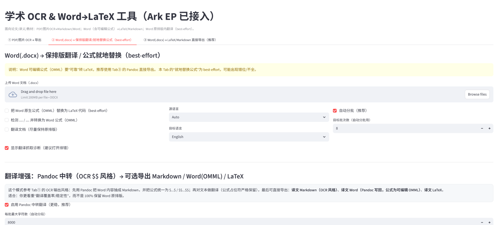
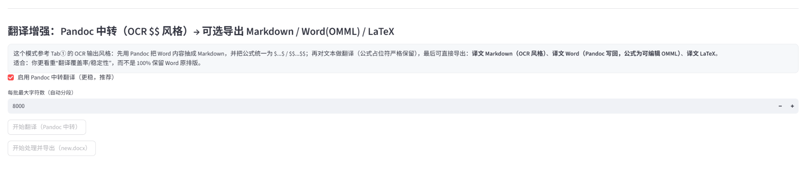
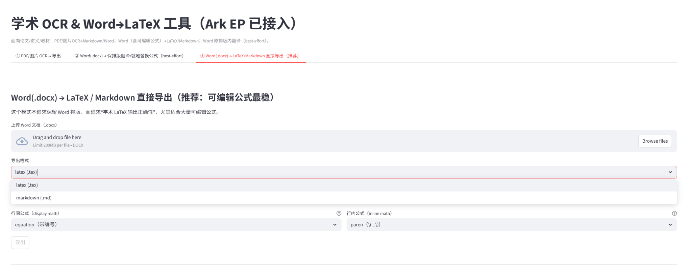
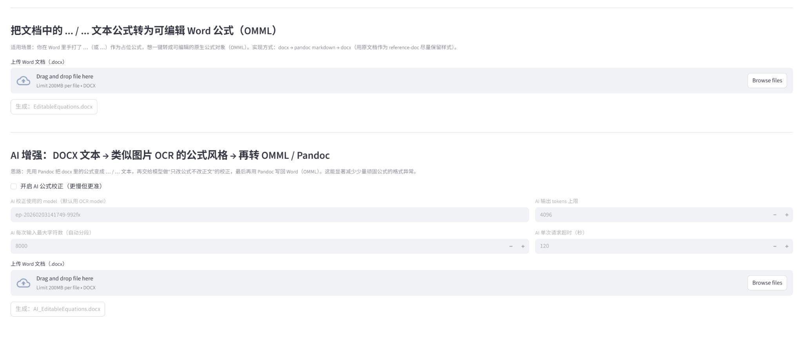
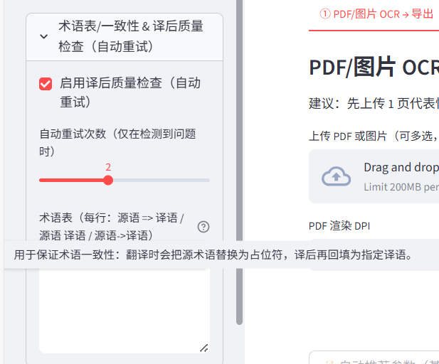
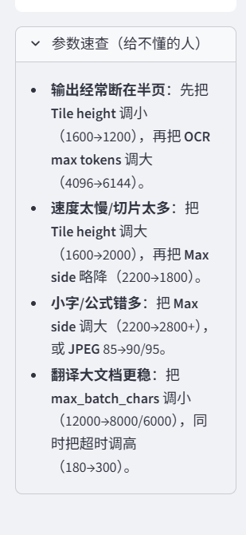

# math-scanner — 学术数学OCR & DOCX翻译工具 / Academic Math OCR & DOCX Translator

> **中文简介：** 这是一个面向科研和学习场景的轻量级工具，支持从图片或 PDF 中提取公式和文本，将其统一为 `$...$` 或 `$$...$$` 的 Markdown 形式，并能回写为可编辑的 Word 公式 (OMML)。此外，它还提供 Word 文档的直译、导出以及术语表一致性和译后质量检查功能。

> **English:** A lightweight tool for academic users that converts images or PDF pages into Markdown with unified `$...$`/`$$...$$` math delimiters and exports editable Word equations (OMML).  It also supports in‑place translation of DOCX files, direct export to LaTeX/Markdown, glossary‑driven consistency, and post‑translation quality assurance.


## 🎬 Demo

在线体验地址：<https://math-scanner-o8hoimyrplpjff8nj8lbtt.streamlit.app/#pdf-ocr>

### 🖼 截图 / Screenshots

#### 概览 / Overview


<details>
<summary>更多截图 / More screenshots</summary>

**PDF/图片 OCR → Markdown**


**Word(.docx) 保排版翻译 / 就地替换公式**



**翻译增强：Pandoc 中转（OCR $$ 风格）**



**Word(.docx) → LaTeX/Markdown 直接导出**



**OMML 可编辑公式 & AI 增强**



**术语表/一致性 & 译后质量检查**



**参数速查**



</details>

## ✨ Features / 功能

- **📄 PDF/图片 OCR → Markdown（$...$ / $$...$$）→ 导出**  
  上传 PDF 或图片，自动识别文本与数学公式，统一用 `$` 或 `$$` 包裹并生成结构化的 Markdown。可选页范围，支持批量处理。

- **📝 Word (.docx) 保排版翻译 / 就地替换公式（best‑effort）**  
  读取 DOCX 文件，逐段翻译正文并保持字体样式，对文档中的公式做占位保护后再写回，可编辑的 OMML 公式尽量保持不变。

- **🔁 翻译增强：Pandoc 中转（OCR $$ 风格）**  
  通过 Pandoc 将 DOCX 先转换为包含 `$`/`$$` 的 Markdown，在翻译过程中保护公式并约束输出语言，最后再回写为可编辑的 Word 公式或 LaTeX 文档，翻译更稳定。

- **📤 Word (.docx) → LaTeX/Markdown 直接导出（推荐：可编辑公式最稳）**  
  将 DOCX 文档转成 LaTeX 或 Markdown，利用 Pandoc 生成包含 `tex_math_dollars` 的标记，并可导出生成的 LaTeX/Markdown 文件。

- **📚 术语表/一致性 + 译后质量检查（自动重试）**  
  支持上传自定义术语表（`source => target` 格式）来确保关键术语翻译一致。翻译完成后会自动检测目标语言中是否残留 CJK 字符或不期望的公式包裹方式，对于失败段落触发自动重试，提升译文质量。

- **📑 PDF 页范围批处理**  
  在上传 PDF 时可指定处理的页码范围，如 `1-3,5,8-10`，仅对感兴趣的页面进行 OCR 与转换，节省时间。

## 🚀 Quickstart / 快速开始

### 安装 / Install

```bash
pip install -r requirements.txt
```

### 本地运行 / Run locally

```bash
streamlit run app.py
```

### 部署 / Deploy on Streamlit Community Cloud

1. 登录 [Streamlit Community Cloud](https://streamlit.io/cloud)。
2. 点击 **New app**，选择仓库 `DoDoDoLaLa/math-scanner`，并将入口文件设置为 `app.py`。
3. 在 **Settings → Secrets** 中添加你的密钥：

   ```toml
   ARK_API_KEY="YOUR_ARK_KEY"
   ```

   > ⚠️ **不要**将你的 API 密钥提交到 GitHub；只需在部署环境的 Secrets 中设置即可。

4. 点击 **Deploy**，稍等片刻即可访问你的在线工具。

## ❓ FAQ / Troubleshooting

以下问题是用户经常遇到的情况，可在此找到解决办法：

- **输出内容只显示了半页，怎么办？**  
  如果处理的 PDF 为双栏排版或包含复杂表格，请尝试勾选“全页模式”，或者在参数设置中调整每页的切片行数。

- **速度慢 / 切片太多**  
  大文档会被分片逐段处理，你可以在参数中减少“最多页数”或者限定页码范围，以降低处理量。若网络延迟高，可尝试本地部署。

- **小字 / 公式识别错误多**  
  OCR 模型对图像清晰度较为敏感，建议先对图片做放大或提升分辨率，再上传处理；对于复杂公式可开启“翻译增强”模式以获得更好的格式统一。

- **翻译大文档不稳定**  
  选择 “Pandoc 中转” 模式，先转换成 Markdown 再翻译，输出会更加连贯。对于超长文本，建议分章节翻译并合并结果。

- **双栏 PDF 阅读顺序不正确**  
  双栏排版会导致 OCR 顺序错乱，目前建议通过 PDF 编辑工具拆分成单栏或者只选取需要的页码进行处理。

- **为什么不能读取 DOCX 里文本框/Shape？**  
  目前的实现基于 python-docx 操作段落和表格，对文本框、形状或浮动对象的抽取支持有限，后续版本计划增强对这些对象的处理。

## ⚠️ Limitations / 限制

- Pandoc 在处理复杂数学公式时对 `$`/`$$` 的行内行间要求严格，译后仍可能需要人工检查。
- DOCX 中的浮动对象（文本框、SmartArt、图形）暂不支持完全抽取与回写。
- OCR 模型目前针对拉丁和 CJK 文本训练，对特殊符号可能存在识别偏差。
- 翻译依赖于外部 API，翻译质量和速度受服务稳定性影响。

## 🛣 Roadmap / 未来计划

- ✅ 完成基础功能：OCR → Markdown、DOCX 直译与导出、术语表、一致性检查。
- ⏳ 增强 PDF 版面理解，支持双栏/表格/图表的结构化抽取。
- ⏳ 对齐审校视图，提供原文与译文并列显示以及段落级高亮。
- ⏳ 引用/参考文献识别与 DOI 保护，导出 BibTeX/RIS 格式。
- ⏳ 离线模型支持（例如集成 Nougat 或 pix2tex）以便脱机使用。
- ⏳ 更多导出格式（HTML、EPUB）与自定义模板。

## 🤝 Contributing / 贡献指南

欢迎社区贡献！请阅读 [CONTRIBUTING.md](CONTRIBUTING.md) 了解如何报告问题、提出功能请求以及提交 Pull Request。我们遵循 [Code of Conduct](CODE_OF_CONDUCT.md)，感谢你为建立友好社区做出的贡献。

## 🔐 Security / 安全

本项目不收集用户的任何文档内容或密钥。所有翻译和识别均通过调用外部服务完成。请不要将你的 API 密钥提交到版本库，推荐使用 Streamlit Secrets 或环境变量来管理敏感信息，例如：

```toml
# .streamlit/secrets.toml
ARK_API_KEY = "YOUR_ARK_KEY"
```

## 📄 Citation / 引用

如果本项目对你的研究或工作有帮助，请引用它：

```bibtex
@software{math_scanner,
  author  = {DoDoDoLaLa},
  title   = {math-scanner: Academic Math OCR & DOCX Translator},
  version = {0.1.0},
  url     = {https://github.com/DoDoDoLaLa/math-scanner},
  date    = {2026-02-04}
}
```
